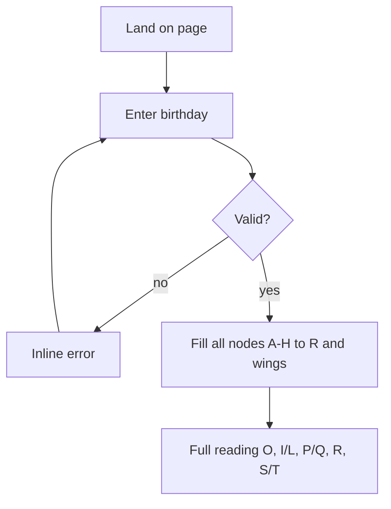

# Life Code Hologram Parser - Plan

## Goal Capsule

- Objective: Ship a visitor-facing page that takes a Gregorian birthday, fills the Asia Training 生命密碼全息圖 nodes with single-digit codes, seats them on the 「全」 glyph, and presents the full reading in one pass.
- Product authority: This plan owns the parse + read experience for the hologram diagram. Broader marketing site, account system, and full interpretive copy library are not active scope.
- Open blockers: None that block planning. Interpretive copy source is an assumption (placeholder-capable for v1).

## Product Contract

### Summary

A single interactive front page lets a visitor enter their birthday, computes every hologram node (A–H inputs through R and side wings S/T), seats the digits on the reference 「全」 diagram, and shows the whole reading directly below in one pass.

### Key Decisions

- **KD1. Showcase = parse experience** — The marketing surface is the calculator + reading, presented as a hologram. `(session-settled: user-directed — chosen showcase/marketing + digital-product framing, then refined to hologram parse page)` Governs R1, R8.
- **KD2. Single-digit reduction on every node** — Each sum is reduced to one digit before display or further use. `(session-settled: user-directed — chosen over keep-full-sum)` Governs R3, R4.
- **KD3. One-pass reading, no step navigation** — The filled diagram and the full analysis appear together; no next/back tour chrome. `(session-settled: user-directed — replaced the earlier step-based tour for a simpler page)` Governs R6, R7.
- **KD4. Reading covers core plus wings in one view** — Sections: **O（主性格）** → **I / L（內在基礎）** → **P / Q（外在表達）** → **R（整合方向）** → **S / T（左右延伸）**. Governs R6.
- **KD5. Visual approach = HTML/SVG hologram** — Render the 「全」 glyph strokes as SVG paths and place node values as absolutely positioned HTML on top, so every digit lands on an exact slot from the reference sheet. `(session-settled: user-directed — chosen over WebGL after the 3D scene made node registration imprecise)` Governs R5, R8, R12.
- **KD6. Reference diagram is layout authority** — Node topology and labels follow `docs/assets/life-code-hologram-reference.png`; 3D placement is a spatial interpretation of that sheet, not a free redesign. Governs R5.

### Actors

- Visitor: enters birthday, reads the filled diagram and the analysis below it.
- Content owner (offline): supplies or later replaces node interpretation copy (not an in-app role in v1).

### Requirements

**Input and calculation**

- R1. The page accepts a Gregorian birthday and maps it to eight digits A–H: day → A,B; month → C,D; year → E,F,G,H (zero-padded where needed).
- R2. The page computes all derived nodes with these formulas (after R3 reduction on every result):
  - I = A+B, J = C+D, K = E+F, L = G+H
  - M = I+J, N = K+L, O = M+N
  - P = M+O, Q = N+O, R = Q+P
  - X = I+M, W = J+M, S = X+W
  - V = K+N, U = L+N, T = V+U
- R3. Every addition result is reduced to a single digit 0–9 before display or reuse (repeated digit-sum; no multi-digit value is left on a node).
- R3a. Special rule: when both addends are 0, the node records **5** instead of 0. This is the 西元 2000 年 case (year tail `00` → L = 5) and applies to any 0+0 pair.
- R4. Invalid or incomplete birthdays block calculation and show a clear inline error; no partial fake graph.

**Visualization**

- R5. After a valid birthday, the page renders the 「全」 glyph with every computed digit seated on its reference slot: R/Q/P above the roof, O inside the roof as the emphasized 主性格 node, M/N and I/J/K/L inside the 王 strokes, A–H on the birthday row, and the S/X/W and V/U/T wings level with O.
- R8. The first viewport reads as one composition: brand/title signal, birthday entry, and the hologram — not a dashboard of cards.
- R12. O（主性格）stays visually emphasized; all other nodes are readable and equally weighted. The glyph and all nodes scale together so the diagram stays fully visible without panning or zooming, including on mobile.

**Reading**

- R6. After a valid birthday the page shows the full reading in one pass: O, then I/L, P/Q, R, and S/T — no step navigation, no next/back/replay controls.
- R7. Each reading section names its digits and gives a short interpretation drawn from the 0–9 digit table.
- R10. v1 ships with local digit copy (0–9); swapping in richer or AI-generated copy must not require changing calculation logic.

**Conversion (light)**

- R11. No CTA or appointment surface in v1; the page ends with a scope note about how to read the result.

### Key Flows

**F1. First parse**

1. Visitor lands → sees brand title + birthday input (diagram watermarked).
2. Submits valid date → all nodes fill on the glyph.
3. Full reading renders below: O, I/L, P/Q, R, S/T.

**F2. Change birthday**

1. Visitor edits date → recalculates → diagram and reading both refresh in place.

### Acceptance Examples

- AE1. When birthday is 1984-12-25, digits are A2 B5 C1 D2 E1 F9 G8 H4; I=reduce(2+5)=7; J=3; K=1+9→1+0→1; L=8+4→1+2→3; and every displayed node is a single digit. Covers R1–R3.
- AE2. When day is blank or month is 13, submit does not fill the graph and shows an error. Covers R4.
- AE3. When birthday is 2000-01-01, G=0 and H=0 so L=5 (not 0), and downstream N/O follow from 5. Covers R3a.
- AE4. When a valid birthday is submitted, the diagram and all five reading sections are present at once, and no next/back/replay control exists. Covers R6, R7, R11.

### Success Criteria

- A new visitor can enter a birthday and read the whole result without any navigation step.
- Every digit sits on its reference slot at desktop and mobile widths, with no node clipped by the viewport.
- Calculation matches R2–R3 for sampled dates (manual check table in planning/tests).
- The reference example 08 07 19 74 reproduces the published node values, including the wings.

### Scope Boundaries

**In scope (v1)**

- Birthday → compute → glyph-seated hologram fill → full one-pass reading
- Reference-faithful node topology and reduction rules above (including the 0+0 → 5 rule)

**Deferred**

- Full interpretive encyclopedia / paid unlock
- Accounts, save history, share card image export
- 3D/WebGL rendering of the same topology
- Non-Gregorian calendar input
- Admin CMS for copy

**Out of scope**

- Backend numerology API as a product itself
- Replacing Asia Training’s teaching methodology

### Dependencies / Assumptions

- A1. Reference image at `docs/assets/life-code-hologram-reference.png` is the visual source of truth for node topology.
- A2. Real 數字→意義 copy may arrive later; placeholders are acceptable for first ship.
- A3. Branding is Asia Training 生命密碼全息圖; final brand tokens (exact purple/green) follow the reference.

### Outstanding Questions

- Q1. Settled: no CTA in v1.
- Q2. Settled: interpretation keys by digit (0–9 table), grouped by node position in the reading sections.
- Q3. Resolve Before Planning only if teaching rules differ: confirm reduce(9+9)=9 (not 18 left as-is) — default yes per KD2.
